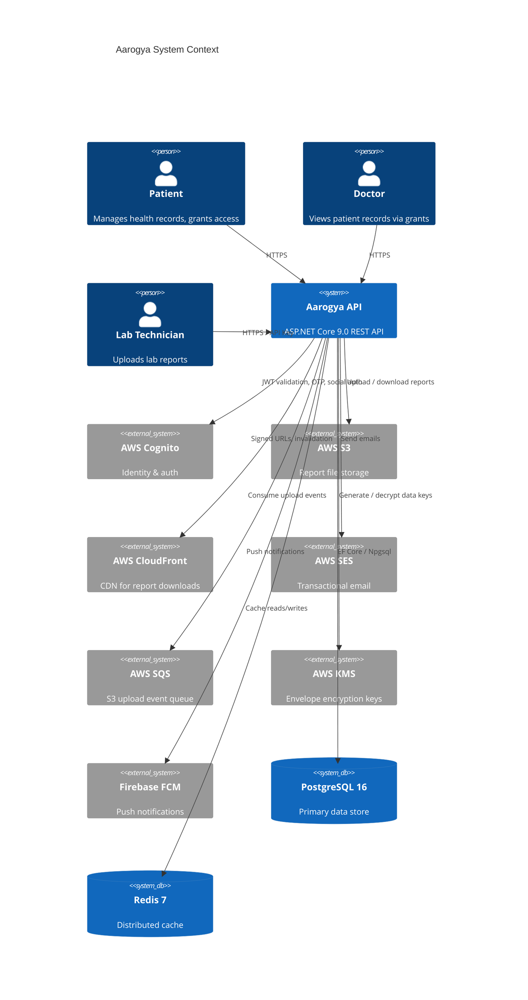
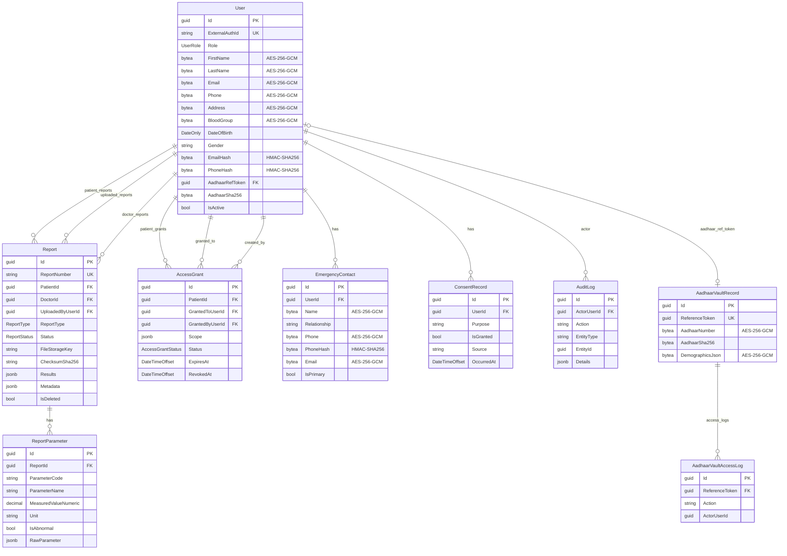
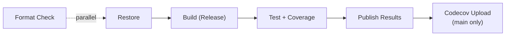

# Aarogya Backend Architecture

> High-level architecture reference for the Aarogya healthcare records management platform.
> For task-level detail see the [Backlog](BACKLOG.md) and individual [workstream docs](workstreams/).

---

## Table of Contents

1. [System Overview](#system-overview)
2. [Architecture Diagram](#architecture-diagram)
3. [Layer Responsibilities](#layer-responsibilities)
4. [Domain Model](#domain-model)
5. [Security Architecture](#security-architecture)
6. [Data Flow Patterns](#data-flow-patterns)
7. [Background Processing](#background-processing)
8. [API Design](#api-design)
9. [Infrastructure & Deployment](#infrastructure--deployment)
10. [CI/CD Pipeline](#cicd-pipeline)
11. [Testing Strategy](#testing-strategy)
12. [Cross-references](#cross-references)

---

## System Overview

Aarogya is an ASP.NET Core 9.0 REST API that manages healthcare records for patients, doctors, and lab technicians in India. It handles sensitive patient data with PII encryption, Aadhaar vault tokenization, medical report storage, and consent-gated access control.

**Company:** Kinvee Technologies | **Region:** AWS `ap-south-1` | **Auth:** AWS Cognito (LocalStack for local dev)

### Technology Stack

| Layer | Technology |
|-------|-----------|
| Runtime | .NET 9.0 / C# 13 |
| Web framework | ASP.NET Core Minimal + Controllers |
| Database | PostgreSQL 16 (EF Core + Npgsql) |
| Cache | Redis 7 (via `IDistributedCache`) |
| Object storage | AWS S3 |
| CDN | AWS CloudFront |
| Email | AWS SES v2 |
| Queue | AWS SQS |
| Encryption | AWS KMS / local AES-256-GCM |
| Auth provider | AWS Cognito |
| Push notifications | Firebase Cloud Messaging |
| Virus scanning | ClamAV (in-process) |
| Orchestration | Docker Compose / .NET Aspire / Kubernetes |
| CI/CD | GitHub Actions |

### Clean Architecture Layers

```
Aarogya.Api  ──>  Aarogya.Domain + Aarogya.Infrastructure
Aarogya.Infrastructure  ──>  Aarogya.Domain
Aarogya.Domain  ──>  (no project references)
```

The **Domain** layer is dependency-free, containing entities, value objects, enums, repository interfaces, and specifications. **Infrastructure** implements persistence, security, and AWS integrations. **API** contains controllers, feature services, authentication, and middleware.

---

## Architecture Diagram



### Internal Layer Diagram

```mermaid
graph TB
  subgraph "Aarogya.Api"
    Controllers["Controllers<br/>(Auth, V1/*)"]
    Features["Features/V1<br/>(Services, Contracts)"]
    Auth["Authentication<br/>(Cognito, Local JWT, API Key)"]
    Authz["Authorization<br/>(RBAC Policies)"]
    Middleware["Middleware<br/>(Security Headers, Rate Limiting, Logging)"]
    Validation["FluentValidation"]
    Config["Configuration<br/>(*Options)"]
  end

  subgraph "Aarogya.Domain"
    Entities["Entities<br/>(User, Report, AccessGrant, ...)"]
    ValueObjects["Value Objects<br/>(Scope, Metadata, Results)"]
    Enums["Enums<br/>(UserRole, ReportStatus, ...)"]
    RepoInterfaces["Repository Interfaces<br/>(IRepository, IUnitOfWork)"]
    Specs["Specifications<br/>(BaseSpecification)"]
  end

  subgraph "Aarogya.Infrastructure"
    DbContext["AarogyaDbContext<br/>(EF Core)"]
    Repos["Repositories<br/>(Repository, UnitOfWork)"]
    Converters["Value Converters<br/>(Encrypted, JSONB, Enum)"]
    Security["Security Services<br/>(PII Encryption, Blind Index)"]
    AadhaarVault["Aadhaar Vault"]
    AwsServices["AWS Clients<br/>(S3, SES, SQS, KMS)"]
  end

  Controllers --> Features
  Features --> RepoInterfaces
  Features --> Specs
  Controllers --> Auth
  Controllers --> Authz
  Controllers --> Validation

  Repos --> DbContext
  Repos -.->|implements| RepoInterfaces
  DbContext --> Converters
  DbContext --> Security
  DbContext --> Entities
```



---

## Layer Responsibilities

### API Layer (`Aarogya.Api`)

| Component | Path | Purpose |
|-----------|------|---------|
| **Controllers** | `Controllers/`, `Controllers/V1/` | HTTP endpoints; `AuthController` (unversioned), V1 controllers for domain features |
| **Features** | `Features/V1/` | Service interfaces (`I*Service`), implementations, cached decorators, contracts (`sealed record` DTOs) |
| **Authentication** | `Authentication/` | OTP, PKCE, social OAuth, API key handler, scheme selection |
| **Authorization** | `Authorization/` | Role-based policies (`Patient`, `Doctor`, `LabTechnician`, `Admin`, `AnyRegisteredRole`, `LabIntegrationApiKey`) |
| **Validation** | `Validation/` | FluentValidation validators for request DTOs |
| **Configuration** | `Configuration/` | `*Options` classes bound to config sections |
| **Program.cs** | Root | Middleware pipeline, service registration, health checks |

### Domain Layer (`Aarogya.Domain`)

| Component | Path | Purpose |
|-----------|------|---------|
| **Entities** | `Entities/` | `User`, `Report`, `ReportParameter`, `AccessGrant`, `EmergencyContact`, `ConsentRecord`, `AuditLog`, `AadhaarVaultRecord`, `AadhaarVaultAccessLog` |
| **Enums** | `Enums/` | `UserRole`, `ReportStatus`, `ReportType`, `AccessGrantStatus` |
| **Value Objects** | `ValueObjects/` | `AccessGrantScope`, `ReportResults`, `ReportMetadata`, `ReportParameterRaw`, `AuditLogDetails` |
| **Repository Interfaces** | `Repositories/` | `IRepository<T>`, `IUserRepository`, `IReportRepository`, etc., `IUnitOfWork` |
| **Specifications** | `Specifications/` | `BaseSpecification<T>` and ~20 concrete specifications for all query patterns |

### Infrastructure Layer (`Aarogya.Infrastructure`)

| Component | Path | Purpose |
|-----------|------|---------|
| **Persistence** | `Persistence/` | `AarogyaDbContext`, entity configurations, value converters, repositories, migrations |
| **Security** | `Security/` | `PiiFieldEncryptionService`, `BlindIndexService`, `DataEncryptionKeyRotationService` |
| **Aadhaar** | `Aadhaar/` | `AadhaarVaultService` — tokenization, SHA-256 dedup, access logging |
| **AWS** | `Aws/` | SDK client registration (S3, SES, SQS, KMS, Cognito, CloudFront) with LocalStack support |
| **Seeding** | `Seeding/` | `DevelopmentDataSeeder` (Bogus faker data) |

---

## Domain Model

### Entity Relationship Diagram



### Enums

| Enum | Values |
|------|--------|
| `UserRole` | `Patient`, `Doctor`, `LabTechnician`, `Admin` |
| `ReportStatus` | `Draft` &rarr; `Uploaded` &rarr; `Processing` &rarr; `Clean`/`Infected` &rarr; `Validated` &rarr; `Published` &rarr; `Archived` |
| `ReportType` | `BloodTest`, `UrineTest`, `Radiology`, `Cardiology`, `Other` |
| `AccessGrantStatus` | `Active`, `Revoked`, `Expired` |

All enums are stored as **snake_case strings** in PostgreSQL via `EnumSnakeCaseConverter`.

### Value Objects (JSONB)

| Value Object | Key Fields |
|-------------|-----------|
| `AccessGrantScope` | `CanReadReports`, `CanDownloadReports`, `AllowedReportIds`, `AllowedReportTypes` |
| `ReportResults` | `ReportVersion`, `Notes`, `Parameters[]` (Code, Name, Value, Unit, ReferenceRange, AbnormalFlag) |
| `ReportMetadata` | `SourceSystem`, `Tags` (dictionary) |
| `ReportParameterRaw` | `Attributes` (dictionary) |
| `AuditLogDetails` | `Summary`, `Data` (dictionary) |

---

## Security Architecture

### PII Encryption

All personally identifiable information is encrypted at rest using **AES-256-GCM** with EF Core value converters, stored as `bytea` columns in PostgreSQL.

**Encrypted fields:** `User.FirstName`, `User.LastName`, `User.Email`, `User.Phone`, `User.Address`, `User.BloodGroup`, `EmergencyContact.Name`, `EmergencyContact.Phone`, `EmergencyContact.Email`, `AadhaarVaultRecord.AadhaarNumber`, `AadhaarVaultRecord.DemographicsJson`

**Encryption modes:**

| Mode | Config | Key Management |
|------|--------|---------------|
| Local key | `Encryption:UseAwsKms = false` | SHA-256 of `LocalDataKey` secret; supports versioned key ring via `LegacyLocalDataKeys` |
| AWS KMS envelope | `Encryption:UseAwsKms = true` | `GenerateDataKey` per encrypt; wrapped DEK stored in ciphertext payload |

**Payload format (v2):** `[version:1B][keyIdLen:2B][keyId:NB][wrappedKeyLen:2B][wrappedKey:MB][nonce:12B][tag:16B][ciphertext:...]`

### Blind Indexes

**HMAC-SHA256** blind indexes enable querying encrypted columns without decryption. Key derived from `Encryption:BlindIndexKey` via SHA-256. Scoped computation: `HMAC("{scope}:{normalized_value}")`.

Indexed fields: `User.EmailHash`, `User.PhoneHash`, `EmergencyContact.PhoneHash`. Computed automatically in `AarogyaDbContext.SaveChanges`.

### Aadhaar Vault Tokenization

Aadhaar numbers are stored in a dedicated `aadhaar_vault_records` table with:
- **Opaque reference token** (`Guid`) — shared externally instead of the raw number
- **SHA-256 hash** — for deduplication lookup
- **Encrypted Aadhaar** — AES-256-GCM
- **Access logging** — every read/write creates an `AadhaarVaultAccessLog` entry

### Authentication Schemes

Three schemes behind a single `Bearer` policy scheme selector:

| Scheme | When Used | Validation |
|--------|----------|-----------|
| **CognitoJwt** | Default for `Authorization: Bearer` tokens | Cognito JWKS endpoint; audience = `AppClientId`; role from `cognito:groups` |
| **LocalJwt** | When `Jwt:Key/Issuer/Audience` are all configured | Standard JWT validation; role from `role` claim |
| **ApiKeyAuthentication** | When `X-Api-Key` header is present | Validates against `InMemoryApiKeyService`; assigns `LabTechnician` role |

The `ForwardDefaultSelector` inspects the incoming request to route to the correct scheme. `AarogyaRoleClaimsTransformation` maps `cognito:groups` to `ClaimTypes.Role`.

### Authorization Policies (RBAC)

| Policy | Requirement |
|--------|------------|
| `AnyRegisteredRole` | Role in `[Patient, Doctor, LabTechnician, Admin]` |
| `Patient` | Role = `Patient` |
| `Doctor` | Role = `Doctor` |
| `LabTechnician` | Role = `LabTechnician` |
| `Admin` | Role = `Admin` |
| `LabIntegrationApiKey` | Authenticated + `auth_method=api_key` + Role = `LabTechnician` |

### Consent Enforcement

All data-access endpoints require explicit user consent. Four consent purposes are defined in `ConsentPurposeCatalog`:

| Purpose | Required By |
|---------|------------|
| `profile_management` | `UsersController` |
| `medical_records_processing` | `ReportsController` |
| `medical_data_sharing` | `AccessGrantsController` |
| `emergency_contact_management` | `EmergencyContactsController` |

Consent is checked via `ConsentService.EnsureGrantedAsync()`. Missing consent returns HTTP 403. Each consent change creates a new immutable `ConsentRecord` row (append-only audit trail).

---

## Data Flow Patterns

### Request Pipeline

```mermaid
graph LR
  A["Swagger"] --> B["Request Logging"]
  B --> C["API Versioning"]
  C --> D["Forwarded Headers"]
  D --> E["Security Headers"]
  E --> F["HTTPS Redirect"]
  F --> G["HSTS"]
  G --> H["CORS"]
  H --> I["Response Caching"]
  I --> J["Authentication"]
  J --> K["Rate Limiter"]
  K --> L["Authorization"]
  L --> M["Controllers"]
  M --> N["Health Checks"]
```



### Repository + Specification Pattern

All database queries flow through the specification pattern — no raw LINQ in controllers or services:

```
Controller
  └─> Feature Service
        └─> IRepository<T>.ListAsync(specification)
              └─> SpecificationEvaluator.ApplySpecification(query, spec)
                    └─> Applies: Criteria, Includes, OrderBy, Skip/Take, AsNoTracking
```

Specifications extend `BaseSpecification<T>` and define query parameters declaratively. Examples:
- `ReportsByPatientSpecification` — filters non-deleted reports for a patient, includes parameters
- `ActiveAccessGrantsForDoctorSpecification` — active grants where a doctor is the grantee
- `RecentAuditLogsSpecification` — audit logs within a time window (used by breach detection)

### Unit of Work

All mutations go through `IUnitOfWork.SaveChangesAsync()`, never `DbContext.SaveChangesAsync()` directly. The `AarogyaDbContext.SaveChanges` override automatically:
1. Sets `CreatedAt`/`UpdatedAt` on `IAuditableEntity` entities
2. Computes blind indexes for encrypted fields

### Caching Decorator Pattern

Three services use the decorator pattern for transparent caching via `IDistributedCache` (Redis or in-memory):

```
Controller ──> ICachedService (decorator) ──> IService (implementation) ──> IRepository
                    │                                                          │
                    └──── IEntityCacheService (Redis) <────────────────────────┘
```

| Interface | Cached Decorator | TTL Config |
|-----------|-----------------|-----------|
| `IUserProfileService` | `CachedUserProfileService` | `EntityCache:UserProfileTtlSeconds` (300s) |
| `IReportService` | `CachedReportService` | `EntityCache:ReportListingTtlSeconds` (120s) |
| `IAccessGrantService` | `CachedAccessGrantService` | `EntityCache:AccessGrantTtlSeconds` (120s) |

Cache invalidation uses **versioned namespaces** — incrementing the namespace version effectively invalidates all keys without scanning Redis.

---

## Background Processing

| Worker | Schedule | Purpose |
|--------|----------|---------|
| `DataEncryptionKeyRotationHostedService` | Every 24h (`EncryptionRotation:CheckIntervalMinutes`) | Re-encrypts PII fields (`User`, `EmergencyContact`, `AadhaarVaultRecord`) under the current active key. Paginated cursor-based processing. |
| `BreachDetectionHostedService` | Every 1 min (`BreachDetection:ScanIntervalMinutes`) | Scans recent audit logs for suspicious patterns (high-frequency access, bulk export). Sends email + push alerts to admins and optionally impacted users. |
| `S3UploadEventConsumerHostedService` | Long-poll SQS | Consumes S3 upload event notifications. Triggers virus scan pipeline for uploaded report files. |
| `S3UploadNotificationConfiguratorHostedService` | Startup (once) | Configures S3 bucket event notifications to send to SQS on object creation. |
| `ClamAvDefinitionsUpdaterHostedService` | Every 60 min (`VirusScanning:DefinitionsRefreshIntervalMinutes`) | Refreshes ClamAV virus definition database for the in-process scanner. |
| `ReportHardDeleteHostedService` | Every 60 min (`FileDeletion:WorkerIntervalMinutes`) | Hard-deletes soft-deleted reports older than retention period (default 2555 days / ~7 years) from S3. |
| `EmergencyAccessExpiryHostedService` | Every 5 min (`EmergencyAccess:AutoExpiryWorkerIntervalMinutes`) | Expires time-limited emergency access grants. Sends pre-expiry notifications via email, SMS, and push. |

---

## API Design

### Route Summary

| Prefix | Controller | Auth | Rate Limit |
|--------|-----------|------|-----------|
| `api/auth` | `AuthController` | Mixed (mostly `[AllowAnonymous]`) | `auth-policy` |
| `api/v1/users` | `UsersController` | `AnyRegisteredRole` | `api-v1-policy` |
| `api/v1/reports` | `ReportsController` | `AnyRegisteredRole` | `api-v1-policy` |
| `api/v1/access-grants` | `AccessGrantsController` | `AnyRegisteredRole` | `api-v1-policy` |
| `api/v1/consents` | `ConsentsController` | `AnyRegisteredRole` | `api-v1-policy` |
| `api/v1/emergency-contacts` | `EmergencyContactsController` | `Patient` | `api-v1-policy` |
| `api/v1/emergency-access` | `EmergencyAccessController` | Mixed | `api-v1-policy` |
| `api/v1/notifications` | `NotificationsController` | `AnyRegisteredRole` | `api-v1-policy` |
| `/health` | Minimal API | Anonymous | None |
| `/health/ready` | Minimal API | Anonymous | None |

### Auth Endpoints (`api/auth`)

| Method | Route | Description |
|--------|-------|-------------|
| `POST` | `otp/request` | Request phone OTP |
| `POST` | `otp/verify` | Verify phone OTP |
| `POST` | `social/authorize` | Social OAuth authorize URL |
| `POST` | `social/token` | Exchange social auth code for tokens |
| `POST` | `pkce/authorize` | PKCE authorization code |
| `POST` | `pkce/token` | Exchange PKCE code for tokens |
| `POST` | `token/refresh` | Refresh access token |
| `POST` | `token/revoke` | Revoke refresh token |
| `GET` | `me` | Current user claims (requires auth) |
| `POST` | `api-keys/issue` | Issue API key (Admin only) |
| `POST` | `api-keys/rotate` | Rotate API key (Admin only) |
| `GET` | `api-keys/me` | API key identity (API key auth) |
| `POST` | `roles/assign` | Assign user role (Admin only) |

### Versioning

API is versioned via URL path (`/api/v1/`). All domain feature controllers are under V1. The `AuthController` is unversioned at `/api/auth`.

### Rate Limiting

Two named policies with configurable strategy (fixed or sliding window):

| Policy | Default Limit | Window |
|--------|--------------|--------|
| `auth-policy` | 120 requests | 60 seconds |
| `api-v1-policy` | 120 requests | 60 seconds |

Partition key: authenticated user `sub` (preferred) or `RemoteIpAddress`. Standard rate limit headers (`X-RateLimit-Limit`, `Retry-After`) injected by `RateLimitHeadersMiddleware`.

### Validation

Request DTOs are validated using FluentValidation. Validators are in `Aarogya.Api/Validation/`.

### Health Checks

| Endpoint | Tags | Checks |
|----------|------|--------|
| `GET /health` | `live` | Self (liveness probe) |
| `GET /health/ready` | `ready` | PostgreSQL, Redis (if configured), S3, Cognito |

---

## Infrastructure & Deployment

### Docker Compose

Full local development stack:

| Service | Image | Port |
|---------|-------|------|
| `aarogya-api` | Local `Dockerfile` | 8080 |
| `aarogya-postgres` | `postgres:16` | 5432 |
| `aarogya-redis` | `redis:7` | 6379 |
| `aarogya-localstack` | `localstack/localstack:3` | 4566 |
| `aarogya-pgadmin` | `dpage/pgadmin4:8` | 5050 |

LocalStack provides: S3, SQS, Cognito, KMS, SES. A `postgres-init` sidecar enables the `pgcrypto` extension.

### .NET Aspire

`AppHost/AppHost.cs` orchestrates the same services (Postgres, Redis, LocalStack) with the API project, using Aspire's container and project resource model.

### Kubernetes

Manifests in `k8s/` (Kustomize-based):
- **Namespace:** `aarogya`
- **API Deployment:** 1 replica, liveness (`/health`), readiness (`/health/ready`)
- **Supporting services:** Postgres, Redis, pgAdmin (dev cluster)

### AWS Services

| Service | Purpose |
|---------|---------|
| S3 | Report file storage |
| CloudFront | CDN for report downloads (signed URLs, invalidation on delete) |
| SES v2 | Transactional email (report notifications, breach alerts, emergency access) |
| SQS | S3 upload event notifications &rarr; virus scan pipeline |
| KMS | Envelope encryption key generation and decryption |
| Cognito | User authentication (OTP, social, PKCE) |

All AWS clients support LocalStack via `Aws:UseLocalStack = true` with `ForcePathStyle` for S3.

See also: [`infra/aws/cloudfront-report-cdn/`](../infra/aws/cloudfront-report-cdn/) for CloudFormation templates.

---

## CI/CD Pipeline

### `dotnet-ci.yml` (Push/PR to `main`/`develop`)



**Build & Test job:** `dotnet restore` &rarr; `dotnet build --configuration Release` &rarr; `dotnet test` with XPlat Code Coverage &rarr; test report via `dorny/test-reporter` &rarr; coverage summary on PRs &rarr; Codecov upload on `main`.

**Lint job:** `dotnet format --verify-no-changes` (excludes generated migrations).

### `pr-guardrails.yml` (PRs to `main`)

1. **Semantic PR title** — validates Conventional Commits format (`feat`, `fix`, `docs`, `chore`, `refactor`, `perf`, `test`, `ci`)
2. **Dependency review** — fails on `high` severity vulnerabilities (when `ENABLE_DEPENDENCY_REVIEW` repo variable is set)

---

## Testing Strategy

### Test Projects

| Project | Type | Stack |
|---------|------|-------|
| `Aarogya.Api.Tests` | Unit + Integration | xUnit, Moq, FluentAssertions, Testcontainers, `WebApplicationFactory` |
| `Aarogya.Domain.Tests` | Unit | xUnit |
| `Aarogya.Infrastructure.Tests` | Integration | xUnit, Testcontainers (`postgres:16-alpine`) |

### Infrastructure Integration Tests

Use `PostgreSqlContainerFixture` (shared via `[Collection("postgresql-integration")]`) which spins up a real PostgreSQL 16 container. Each test class gets an isolated database via `CreateServiceProviderAsync()`.

### API Integration Tests

`ApiPostgreSqlWebApplicationFactory` extends `WebApplicationFactory<Program>`:
- Replaces AWS clients (S3, SQS, CloudFront) with mocks
- Removes all hosted services
- Uses `TestAuthHandler` with well-known tokens (`"valid-patient"`, `"valid-doctor"`, `"valid-lab"`)
- Seeds integration test users and provides `GrantConsentAsync()` helper

### Test Method Naming

`MethodName_Should*` (e.g., `SaveChanges_ShouldPersistEncryptedEntityAsync`)

### Running Tests

```bash
dotnet test                                     # All tests
dotnet test tests/Aarogya.Api.Tests/            # API tests only
dotnet test --filter "FullyQualifiedName~Class" # Single class
dotnet test --collect:"XPlat Code Coverage"     # With coverage
```

**Note:** Infrastructure tests require Docker for Testcontainers.

---

## Cross-references

| Document | Path | Content |
|----------|------|---------|
| Project instructions | [`CLAUDE.md`](../CLAUDE.md) | Build commands, conventions, coding standards |
| Implementation backlog | [`docs/BACKLOG.md`](BACKLOG.md) | 7 phases, 99 tasks across 9 workstreams |
| Database schema | [`docs/database/core-schema.md`](database/core-schema.md) | Full PostgreSQL schema with constraints and indexes |
| Schema SQL | [`docs/database/core-schema.sql`](database/core-schema.sql) | SQL DDL |
| JSONB index verification | [`docs/database/jsonb-index-verification.sql`](database/jsonb-index-verification.sql) | Verification queries for JSONB indexes |
| PR guardrails | [`docs/github-main-guardrails.md`](github-main-guardrails.md) | PR process and Conventional Commits |
| Encryption key rotation | [`docs/infrastructure/encryption-key-rotation.md`](infrastructure/encryption-key-rotation.md) | Key rotation runbook |
| Audit log archival | [`docs/infrastructure/audit-log-archival.md`](infrastructure/audit-log-archival.md) | Archival strategy |
| Dev environment setup | [`docs/workstreams/01-dev-environment.md`](workstreams/01-dev-environment.md) | Docker, Aspire, LocalStack setup |
| Database & data layer | [`docs/workstreams/02-database-data-layer.md`](workstreams/02-database-data-layer.md) | EF Core, migrations, encryption |
| Auth & authorization | [`docs/workstreams/03-authentication-authorization.md`](workstreams/03-authentication-authorization.md) | Cognito, JWT, API keys, RBAC |
| Core API | [`docs/workstreams/04-core-api.md`](workstreams/04-core-api.md) | Controllers, services, contracts |
| File storage & CDN | [`docs/workstreams/05-file-storage-cdn.md`](workstreams/05-file-storage-cdn.md) | S3, CloudFront, virus scanning |
| Security & compliance | [`docs/workstreams/06-security-compliance.md`](workstreams/06-security-compliance.md) | PII encryption, consent, breach detection |
| Infrastructure & CI/CD | [`docs/workstreams/08-infrastructure-cicd.md`](workstreams/08-infrastructure-cicd.md) | Docker, K8s, GitHub Actions |
| Advanced features | [`docs/workstreams/09-advanced-features.md`](workstreams/09-advanced-features.md) | Emergency access, notifications, data rights |
| CloudFront template | [`infra/aws/cloudfront-report-cdn/`](../infra/aws/cloudfront-report-cdn/) | CloudFormation CDN setup |
