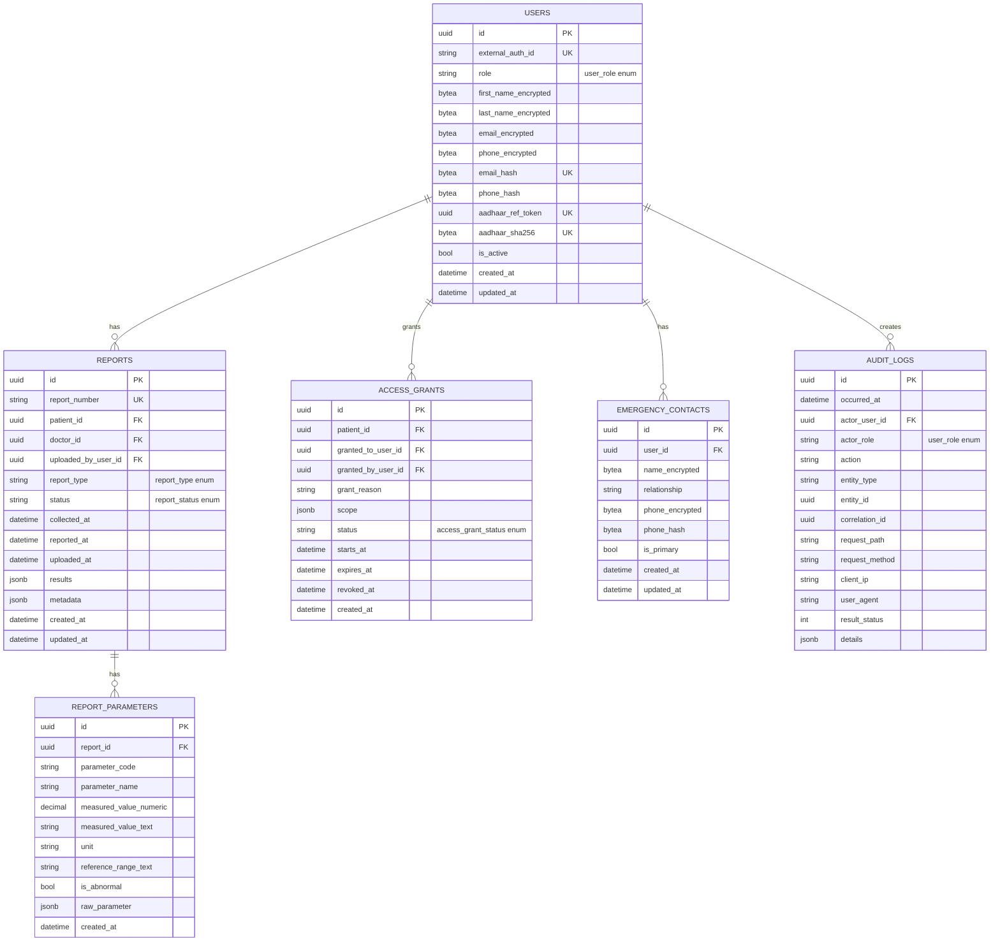

# Core Database Schema Design (Issue #11)

This document defines the proposed PostgreSQL schema for:
- `users`
- `reports`
- `report_parameters`
- `access_grants`
- `emergency_contacts`
- `audit_logs`

Supporting enum types, constraints, JSONB shape, and indexing strategy are included.

## ERD



Detailed FK mappings represented in SQL:
- `reports.patient_id`, `reports.uploaded_by_user_id`, `reports.doctor_id` -> `users.id`
- `access_grants.patient_id`, `access_grants.granted_to_user_id`, `access_grants.granted_by_user_id` -> `users.id`
- `emergency_contacts.user_id` -> `users.id`
- `audit_logs.actor_user_id` -> `users.id`
- `report_parameters.report_id` -> `reports.id`

## SQL Definition

Authoritative SQL DDL is in:
- `docs/database/core-schema.sql`

## JSONB Structure: `reports.results`

`reports.results` is intended for flexible, vendor-specific medical report payloads.

Canonical shape:

```json
{
  "reportVersion": 1,
  "lab": {
    "name": "ABC Diagnostics",
    "code": "ABC-DIAG"
  },
  "parameters": [
    {
      "code": "HGB",
      "name": "Hemoglobin",
      "value": 13.4,
      "unit": "g/dL",
      "referenceRange": "12.0-16.0",
      "abnormalFlag": false
    }
  ],
  "attachments": [
    {
      "type": "pdf",
      "storageKey": "reports/2026/02/report-123.pdf"
    }
  ],
  "notes": "Sample report"
}
```

Notes:
- `report_parameters` stores extracted/searchable values for high-frequency filtering and analytics.
- `results` preserves the full original payload for auditability and extensibility.

## Constraints and Data Integrity

Highlights:
- UUID PKs with `gen_random_uuid()`.
- Foreign keys with explicit delete behavior (`RESTRICT`, `SET NULL`, `CASCADE` by use-case).
- Time-order constraints for report timestamps and access grant validity windows.
- Partial unique index to enforce a single active access grant per patient-grantee pair.
- Partial unique index to enforce one primary emergency contact per user.
- Check constraint on HTTP status codes for audit logs.

## Indexing Strategy

### B-tree indexes
- Operational filters and ordering:
  - `reports(patient_id, uploaded_at desc)`
  - `reports(status, uploaded_at desc)`
  - `audit_logs(actor_user_id, occurred_at desc)`
  - `audit_logs(entity_type, entity_id, occurred_at desc)`

### Partial indexes
- Business rules and sparse high-value lookups:
  - `ux_access_grants_active` where `status = 'active'`
  - `ux_emergency_contacts_primary_per_user` where `is_primary`
  - `ix_report_parameters_value_numeric` where numeric value is present

### GIN indexes for JSONB
- `reports.results` and `reports.metadata` with `jsonb_path_ops`
- `report_parameters.raw_parameter`
- `access_grants.scope`
- `audit_logs.details`

This balances transactional queries, timeline queries, and JSON path search use-cases.

## Scope and Follow-ups

This issue defines schema design only. Follow-up implementation issues should cover:
- EF Core entity mappings and migrations
- seed data
- query plans (`EXPLAIN ANALYZE`) against realistic datasets
- encrypted field handling and Aadhaar vault implementation
